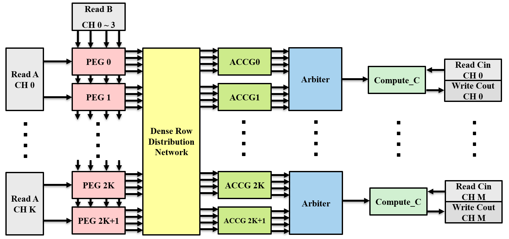

# HiSpMM

**High Performance High Bandwidth Sparse-Dense Matrix Multiplication on HBM-equipped FPGAs**

[](https://www.xilinx.com/products/boards-and-kits/alveo/u280.html)
[](LICENSE)

HiSpMM is an FPGA-accelerated Sparse Matrix-Matrix Multiplication (SpMM) implementation targeting the **Xilinx Alveo U280** accelerator card.

<!-- ## Table of Contents

- [Architecture](#architecture)
- [Features](#features)
- [Design Variants](#design-variants)
- [Prerequisites](#prerequisites)
- [Installation](#installation)
- [Building](#building)
- [Usage](#usage)
- [Input Format](#input-format)
- [License](#license)
- [Citation](#citation) -->

## Architecture



*HiSpMM accelerator architecture showing Processing Element Groups (PEGs), Dense Row Distribution Network, Accumulator Groups (ACCGs), Arbiters, and Compute_C modules with HBM channel connections.*

## Design Variants

| Variant | PEs | A Ports | HBM Channels | Best For | Floorplan Strategy |
|---------|-----|---------|--------------|----------|-------------------|
| **HiSpMM-balanced** | 80 | 10 | 22 | Balanced workloads | `SLR_LEVEL_FLOORPLANNING` |
| **HiSpMM-imbalanced** | 64 | 8 | 20 | Imbalanced workloads | `HALF_SLR_LEVEL_FLOORPLANNING` |


## Features

- **High Performance**: Leverages multiple processing elements (PEs) for parallel SpMM computation
- **HBM Utilization**: Efficiently uses up to 22 HBM channels for high memory bandwidth
- **Two Design Variants**: Optimized configurations for balanced and imbalanced workloads
- **Pre-built Bitstreams**: Ready-to-use FPGA bitstreams for immediate deployment
- **Software Simulation**: Test functionality without FPGA hardware
- **TAPA-based Design**: Task-parallel architecture 

## Prerequisites

### Hardware
- **FPGA**: Xilinx Alveo U280 Data Center Accelerator Card
- **Platform**: `xilinx_u280_gen3x16_xdma_1_202211_1`

### Software
- **OS**: Linux (Ubuntu 18.04 recommended)
- **Xilinx Tools**:
  - Vitis 2023.2
  - XRT (Xilinx Runtime) 2.14+
  - Xilinx HLS (included in Vitis)
- **TAPA**: [Task-Parallel HLS](https://github.com/UCLA-VAST/tapa)
- **Compiler**: g++ with C++17 support
- **Libraries**:
  - `tapa` - TAPA runtime library
  - `frt` - FRT (FPGA Runtime) library
  - `glog` - Google Logging library
  - `gflags` - Google Commandline Flags library
  - `OpenCL` - OpenCL runtime

## Installation

### 1. Install Xilinx Tools

Download and install [Vitis Unified Software Platform](https://www.xilinx.com/support/download/index.html/content/xilinx/en/downloadNav/vitis.html) and set up the environment:

```bash
source /opt/xilinx/Vitis/2023.2/settings64.sh
source /opt/xilinx/xrt/setup.sh
```

### 2. Install PASTA

Follow the [PASTA installation guide](https://github.com/SFU-HiAccel/pasta).

### 3. Install Required Libraries

```bash
sudo apt-get install libgoogle-glog-dev libgflags-dev ocl-icd-opencl-dev
```

### 4. Clone the Repository

```bash
git clone https://github.com/SFU-HiAccel/HiSpMM.git
cd HiSpMM
```

## Building

### Build Host Application

```bash
# For balanced variant
cd HiSpMM-balanced
make host

# For imbalanced variant
cd HiSpMM-imbalanced
make host
```

## Automation Tool (codegen + DSE)

This repo also includes an **automation tool** that can:

- Run **DSE** (cycle + resource estimation) to recommend a configuration for a matrix
- Generate a self-contained build folder with:
  - `src/hispmm.h`
  - `src/hispmm.cpp`
  - `src/hispmm_host.cpp`
  - `Makefile`, `link_config.ini` (and optional floorplan assets)

### Run code generation (recommended pick)

```bash
python -m automation_tool \
  --matrix automation_tool/assets/common/matrices/airfoil_2d.mtx \
  --n 8 \
  --out generated/kernel_auto
```

### Force a specific pick (skip DSE)

```bash
python -m automation_tool --pick imbalanced_a8_c4 --out generated/kernel_pick
```

You can also use legacy aliases:

- `--pick HiSpMM-balanced` → `balanced_a10_c4`
- `--pick HiSpMM-imbalanced` → `imbalanced_a8_c4`

### List supported picks

```bash
python -m automation_tool \
  --matrix automation_tool/assets/common/matrices/airfoil_2d.mtx \
  --n 8 \
  --list-picks
```

### Run only DSE (no code generation)

```bash
python -m automation_tool.dse.cycle_analysis \
  --matrix automation_tool/assets/common/matrices/hangGlider_3.mtx \
  --n 8 \
  --variant sweep
```

Notes:
- `--term2-model` defaults to `runlen`.
- `--resource-limit` can be used to filter recommendations; setting it to a value other than `1.0` enables resource estimation automatically.

 

### Build FPGA Bitstream (Optional)

Pre-built bitstreams are provided. To rebuild from source:

```bash
# Step 1: Generate TAPA hardware object (.xo)
make tapa

# Step 2: Build bitstream (.xclbin)
make hw-build
```

> **Note**: The variants have high resource utilization that may require multiple build attempts to succeed.

## Usage

### Command Line Syntax

```bash
./hispmm [--bitstream=<path>] <matrix.mtx> <iterations> [dense_cols]
```

| Argument | Description |
|----------|-------------|
| `--bitstream` | Path to `.xclbin` file (omit for software simulation) |
| `<matrix.mtx>` | Input sparse matrix in Matrix Market format |
| `<iterations>` | Number of SpMM iterations to run |
| `[dense_cols]` | Number of columns in dense matrix B (default: N=128) |

### Software Simulation (No FPGA Required)

Test the design without hardware:

```bash
# HiSpMM-balanced
cd HiSpMM-balanced
make host
make sw-test
# Or manually:
./hispmm matrices/airfoil_2d.mtx 1 32

# HiSpMM-imbalanced
cd HiSpMM-imbalanced
make host
make sw-test
# Or manually:
./hispmm matrices/hangGlider_3.mtx 1 32
```

### Hardware Execution (FPGA Required)

Run on actual FPGA hardware:

```bash
# HiSpMM-balanced
cd HiSpMM-balanced
./hispmm --bitstream=bitstream/SpMM_xilinx_u280_gen3x16_xdma_1_202211_1.xclbin matrices/airfoil_2d.mtx 1000

# HiSpMM-imbalanced
cd HiSpMM-imbalanced
./hispmm --bitstream=bitstream/SpMM_xilinx_u280_gen3x16_xdma_1_202211_1.xclbin matrices/hangGlider_3.mtx 1000
```

### Using Custom Bitstream

If you rebuilt the bitstream:

```bash
make hw-test
# Or manually:
./hispmm --bitstream=vitis_run_hw/hispmm.xilinx_u280_gen3x16_xdma_1_202211_1.hw.xclbin <matrix.mtx> <iterations>
```

## Make Targets

| Target | Description |
|--------|-------------|
| `make host` | Build the host application |
| `make tapa` | Generate TAPA hardware object (.xo) |
| `make hw-build` | Build FPGA bitstream from .xo |
| `make sw-test` | Run software simulation test |
| `make hw-test` | Run hardware test (requires FPGA) |
| `make clean` | Remove built executables |

## Input Format

Sparse matrices must be in [Matrix Market (.mtx)](https://math.nist.gov/MatrixMarket/formats.html) format.

### Sample Matrices Provided

| Matrix | Location | Description |
|--------|----------|-------------|
| `airfoil_2d.mtx` | `matrices/` | 2D airfoil mesh |
| `hangGlider_3.mtx` | `matrices/` | Optimal control problem |


## License

This project is licensed under the BSD-3-Clause License - see the [LICENSE](LICENSE) file for details.

## Citation

If you use HiSpMM in your research, please cite:

```bibtex
@article{hispmm,
author = {Sedigh Baroughi, Ahmad and Rajashekar, Manoj B. and Baranwal, Akhil R. and Fang, Zhenman},
title = {HiSpMM: High Performance High Bandwidth Sparse-Dense Matrix Multiplication on HBM-equipped FPGAs},
year = {2025},
publisher = {Association for Computing Machinery},
address = {New York, NY, USA},
issn = {1936-7406},
url = {https://doi.org/10.1145/3774327},
doi = {10.1145/3774327},
note = {Just Accepted},
journal = {ACM Trans. Reconfigurable Technol. Syst.},
month = oct,
keywords = {SpMM, Imbalanced Workload, FPGA Accelerator, High Level Synthesis, Design Space Exploration}
}
```

## Acknowledgments

- [TAPA](https://github.com/UCLA-VAST/tapa) - Task-Parallel High-Level Synthesis framework
- [Xilinx](https://www.xilinx.com/) - FPGA platform and development tools
- [SuiteSparse Matrix Collection](https://sparse.tamu.edu/) - Test matrices

## Contact

For questions or issues contact asa582@sfu.ca.

---

**Repository**: [https://github.com/SFU-HiAccel/HiSpMM](https://github.com/SFU-HiAccel/HiSpMM)
